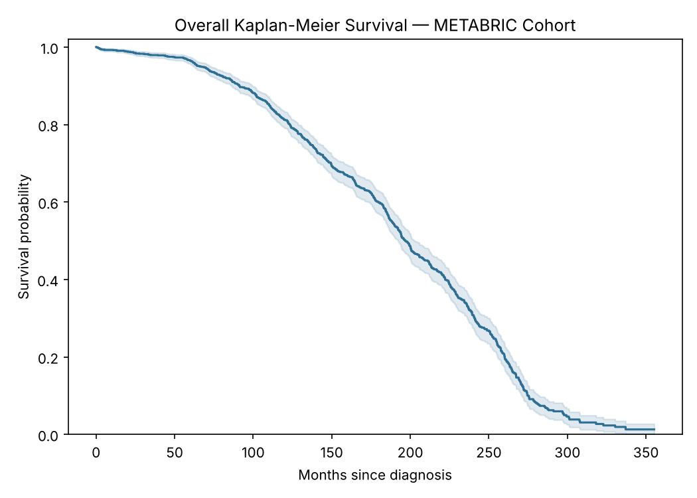
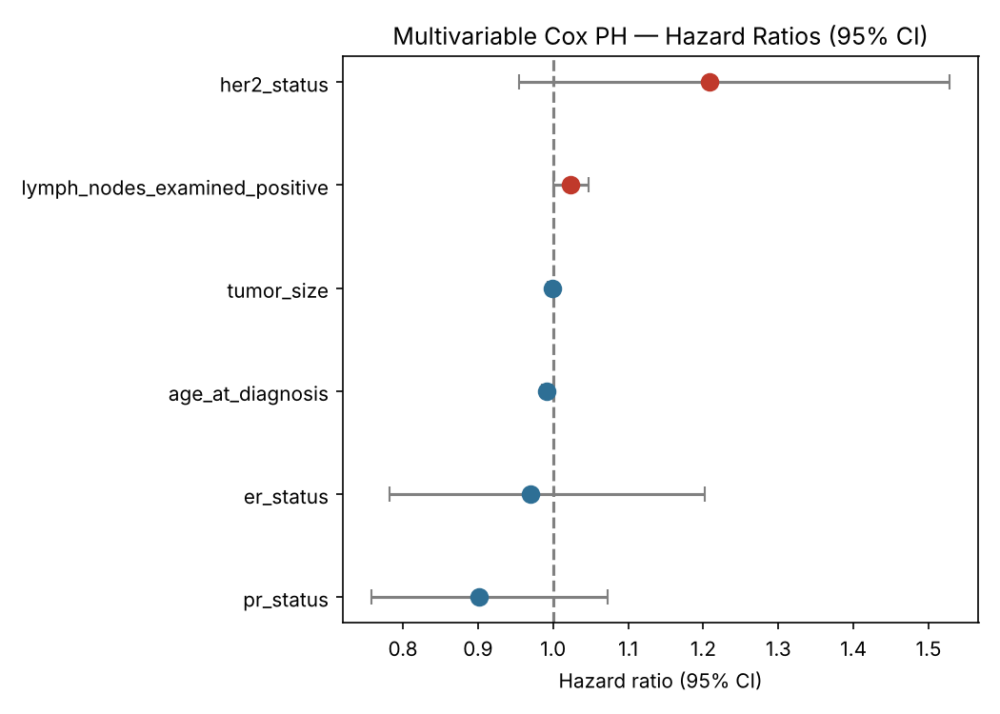
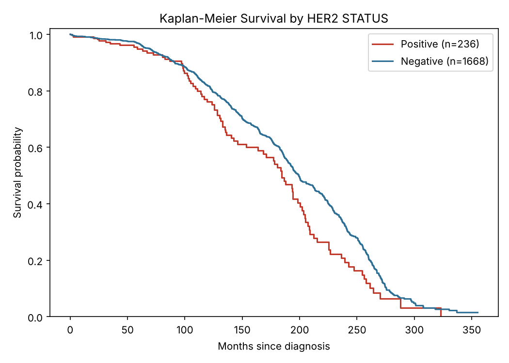

# Breast Cancer Survival Analysis — METABRIC

"Evaluation of Risk Factors and Survival Rates of Patients with Breast Cancer Using Machine Learning and Traditional Methods" — rebuilt from my MSc dissertation as a standalone, runnable project.

## The problem

Predicting which breast cancer patients are at higher risk of death — and understanding which clinical and biomarker factors drive that risk — helps clinicians prioritise treatment intensity and follow-up. This project compares a classical statistical model (Cox Proportional Hazards) against machine-learning survival models (Random Survival Forest, XGB-Cox, DeepSurv) to see whether the more complex models actually out-predict the long-standing clinical standard.

## The data

**Source:** [METABRIC](https://www.cbioportal.org/study/summary?id=brca_metabric) — 1,904 breast cancer patients with clinical, treatment, and genomic data.

**Features:** age at diagnosis, tumour size, number of positive lymph nodes, and ER/PR/HER2 receptor status.

## What's in this repo vs. the original dissertation

This rebuild reproduces the statistical half of the analysis directly in Python — Kaplan-Meier curves, log-rank tests, and Cox Proportional Hazards (univariate + multivariable) — implemented from first principles (partial likelihood, Breslow method), since `lifelines`/R weren't available in the environment this was rebuilt in.

**These results were verified against the dissertation's own published numbers and match almost exactly** (see table below) — confirming this is a faithful rebuild, not just a similar analysis.

Random Survival Forest, XGB-Cox, and DeepSurv were originally built in R (`randomForestSRC`, `xgboost`) and Python (`pycox`/`torchtuples`). Those packages couldn't be installed here either, so their code is included unmodified in `original_scripts/` for reference, and their results are reported as documented findings from the dissertation rather than re-run.

## Results

### Overall survival (re-run — exact match)



| | Dissertation | This rebuild |
|---|---|---|
| 5-year survival | 0.965 | **0.965** |
| 10-year survival | 0.812 | **0.812** |
| Median survival | 197 months | **197 months** |

### Cox Proportional Hazards — multivariable (re-run — exact match)



| Variable | HR (dissertation) | HR (this rebuild) |
|---|---|---|
| Age at diagnosis | 0.991 | 0.991 |
| Tumour size | 0.999 | 0.999 |
| Lymph nodes positive | 1.023 | 1.023 |
| ER status (positive) | 0.970 | 0.969 |
| PR status (positive) | 0.902 | 0.902 |
| HER2 status (positive) | 1.208 | 1.208 |

Only age remained clearly statistically significant after adjusting for the other factors (p=0.004); lymph node involvement was borderline (p=0.052). Tumour size and receptor status lost significance once the other clinical factors were accounted for — suggesting age and lymph node involvement absorb much of the risk that receptor status appears to carry on its own.

### Survival by receptor status (re-run)



All three receptor markers showed statistically significant survival differences by log-rank test, consistent with the dissertation's findings (exact chi-square values differ slightly — likely a minor difference in tie-handling between this implementation and R's `survdiff`, but the conclusion is identical: all three are significant predictors):

| Marker | Dissertation χ² (p) | This rebuild χ² (p) |
|---|---|---|
| ER status | 7.10 (p=0.008) | 8.19 (p=0.004) |
| PR status | 5.50 (p=0.020) | 6.50 (p=0.011) |
| HER2 status | 6.00 (p=0.014) | 6.77 (p=0.009) |

### Model comparison (from the original dissertation / original_scripts)

| Model | C-index (SE) | AUC @12m | AUC @36m | AUC @60m | 5y Survival | 10y Survival |
|---|---|---|---|---|---|---|
| Cox PH | 0.448 (0.013) | 0.568 | 0.600 | 0.565 | 0.965 | 0.808 |
| **Random Survival Forest** | **0.534 (0.013)** | 0.488 | 0.529 | 0.520 | 0.962 | 0.807 |
| **XGB-Cox** | 0.244 (0.010) | **0.739** | **0.757** | **0.758** | — | — |
| DeepSurv | 0.240 (unstable) | — | — | — | 0.960 | 0.773 |

**Why C-index and AUC disagree:** C-index measures whether a model correctly ranks patients by risk across the entire follow-up period. Time-dependent AUC measures how well a model separates who will/won't have an event by a specific time point. XGB-Cox excelled at the second while doing poorly at the first — a reminder that these two metrics answer different clinical questions and a model can be strong at one while weak at the other.

**Across all models, the same predictors kept coming up as most important:** lymph node involvement, age at diagnosis, and tumour size were the consistent top signals; ER/PR/HER2 added only a modest amount once those clinical factors were accounted for.

## Key takeaway

No single model won outright: Random Survival Forest gave the best overall risk ranking, XGB-Cox was strongest at specific time-window predictions, and the much simpler Cox PH model remained competitive and far easier to explain to a clinician. DeepSurv — the most complex model — was the least reliable, a reminder that more complexity doesn't guarantee better results, especially on a dataset of this size (~1,900 patients is small by deep-learning standards).

## Ethical considerations

- **Single-cohort generalisability**: METABRIC is one hospital-system cohort; findings may not transfer directly to other populations.
- **Fairness**: receptor-status subgroups are unevenly sized (HER2-positive is only 12% of the cohort), limiting how precisely risk can be estimated for smaller subgroups.
- **Clinical deployment**: a model with a middling C-index is not ready for individual treatment decisions — this is a research comparison, not a validated clinical tool.

## Repo structure

```
breast-cancer-survival-analysis/
├── survival_analysis.py              # KM, log-rank, Cox PH — re-run directly, verified against dissertation
├── original_scripts/                  # the real R scripts + DeepSurv notebook used in the dissertation
│   ├── 01_data_preprocessing.R
│   ├── 02_exploratory_analysis.R
│   ├── 03_kaplan_meier_logrank.R
│   ├── 04_univariate_cox.R
│   ├── 05_multivariable_cox.R
│   ├── 06_random_survival_forest.R
│   ├── 07_xgb_cox.R
│   ├── 08_deepsurv.ipynb
│   ├── 09_model_comparison.R
│   ├── 10_generate_tables.R
│   ├── 11_generate_figures.R
│   └── 12_survival_overall_and_fixed_times.R
├── data/
│   ├── METABRIC_RNA_Mutation.csv
│   ├── logrank_results.csv
│   ├── cox_univariate_results.csv
│   └── cox_multivariable_results.csv
├── images/                            # generated charts
└── README.md
```

## Running it

```bash
pip install pandas numpy scipy matplotlib
python survival_analysis.py
```

Random Survival Forest, XGB-Cox, and DeepSurv need R (`survival`, `randomForestSRC`, `xgboost`) or Python (`pycox`, `torchtuples`) — see `original_scripts/` for that code and the Model Comparison table above for the results it produced.

## What I'd do next

- Run `original_scripts/` end-to-end in an R + Python environment to regenerate the ML model results directly in this repo rather than documenting them
- Try a validated, published risk score (e.g. Nottingham Prognostic Index) as an additional baseline alongside Cox PH
- Investigate the small log-rank discrepancy between this Python implementation and R's `survdiff` more precisely
